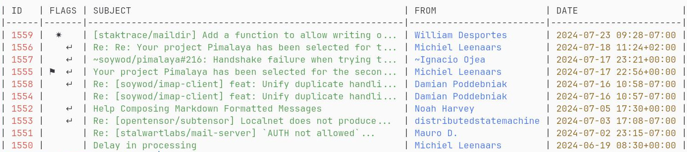

<div align="center">
  
  <h1>📫 Himalaya</h1>
  <p>CLI to manage emails, based on <a href="https://crates.io/crates/email-lib"><code>email-lib</code></a></p>
  <p>
    <a href="https://github.com/pimalaya/himalaya/releases/latest"></a>
	<a href="https://repology.org/project/himalaya/versions"></a>
    <a href="https://matrix.to/#/#pimalaya:matrix.org"></a>
  </p>
</div>

```
$ himalaya envelope list --account posteo --folder Archives.FOSS --page 2
```



## Features

- Multi-accounting
- Interactive configuration via **wizard** (requires `wizard` feature)
- Mailbox, envelope, message and flag management
- Message composition based on `$EDITOR`
- **IMAP** backend (requires `imap` feature)
- **Maildir** backend (requires `maildir` feature)
- **Notmuch** backend (requires `notmuch` feature)
- **SMTP** backend (requires `smtp` feature)
- **Sendmail** backend (requires `sendmail` feature)
- Global system **keyring** for managing secrets (requires `keyring` feature)
- **OAuth 2.0** authorization (requires `oauth2` feature)
- **JSON** output via `--output json`
- **PGP** encryption:
  - via shell commands (requires `pgp-commands` feature)
  - via [GPG](https://www.gnupg.org/) bindings (requires `pgp-gpg` feature)
  - via native implementation (requires `pgp-native` feature)

*Himalaya CLI is written in [Rust](https://www.rust-lang.org/), and relies on [cargo features](https://doc.rust-lang.org/cargo/reference/features.html) to enable or disable functionalities. Default features can be found in the `features` section of the [`Cargo.toml`](https://github.com/pimalaya/himalaya/blob/master/Cargo.toml#L18).*

## Installation

*The `v1.0.0` is currently being tested on the `master` branch, and is the prefered version to use. Previous versions (including GitHub beta releases and repositories published versions) are not recommended.*

### Pre-built binary

Himalaya CLI `v1.0.0` can be installed with a pre-built binary. Find the latest [`pre-release`](https://github.com/pimalaya/himalaya/actions/workflows/pre-release.yml) GitHub workflow and look for the *Artifacts* section. You should find a pre-built binary matching your OS.

### Cargo (git)

Himalaya CLI `v1.0.0` can also be installed with [cargo](https://doc.rust-lang.org/cargo/):

```bash
$ cargo install --frozen --force --git https://github.com/pimalaya/himalaya.git
```

### Other outdated methods

These installation methods should not be used until the `v1.0.0` is finally released, as they are all (temporarily) outdated:

<details>
  <summary>Pre-built binary</summary>

  Himalaya CLI can be installed with a prebuilt binary:

  ```bash
  # As root:
  $ curl -sSL https://raw.githubusercontent.com/pimalaya/himalaya/master/install.sh | sudo sh

  # As a regular user:
  $ curl -sSL https://raw.githubusercontent.com/pimalaya/himalaya/master/install.sh | PREFIX=~/.local sh
  ```

  These commands install the latest binary from the GitHub [releases](https://github.com/pimalaya/himalaya/releases) section.

  *Binaries are built with [default](https://github.com/pimalaya/himalaya/blob/master/Cargo.toml#L18) cargo features. If you want to enable or disable a feature, please use another installation method.*
</details>

<details>
  <summary>Cargo</summary>

  Himalaya CLI can be installed with [cargo](https://doc.rust-lang.org/cargo/):

  ```bash
  $ cargo install himalaya

  # With only IMAP support:
  $ cargo install himalaya --no-default-features --features imap
  ```

  You can also use the git repository for a more up-to-date (but less stable) version:

  ```bash
  $ cargo install --git https://github.com/pimalaya/himalaya.git himalaya
  ```
</details>

<details>
  <summary>Arch Linux</summary>

  Himalaya CLI can be installed on [Arch Linux](https://archlinux.org/) with either the community repository:

  ```bash
  $ pacman -S himalaya
  ```

  or the [user repository](https://aur.archlinux.org/):

  ```bash
  $ git clone https://aur.archlinux.org/himalaya-git.git
  $ cd himalaya-git
  $ makepkg -isc
  ```

  If you use [yay](https://github.com/Jguer/yay), it is even simplier:

  ```bash
  $ yay -S himalaya-git
  ```

</details>

<details>
  <summary>Homebrew</summary>

  Himalaya CLI can be installed with [Homebrew](https://brew.sh/):

  ```bash
  $ brew install himalaya
  ```

</details>

<details>
  <summary>Scoop</summary>

  Himalaya CLI can be installed with [Scoop](https://scoop.sh/):

  ```bash
  $ scoop install himalaya
  ```

</details>

<details>
  <summary>Fedora Linux/CentOS/RHEL</summary>

  Himalaya CLI can be installed on [Fedora Linux](https://fedoraproject.org/)/CentOS/RHEL via [COPR](https://copr.fedorainfracloud.org/coprs/atim/himalaya/) repo:

  ```bash
  $ dnf copr enable atim/himalaya
  $ dnf install himalaya
  ```

</details>

<details>
  <summary>Nix</summary>

  Himalaya CLI can be installed with [Nix](https://serokell.io/blog/what-is-nix):

  ```bash
  $ nix-env -i himalaya
  ```

  You can also use the git repository for a more up-to-date (but less stable) version:

  ```bash
  $ nix-env -if https://github.com/pimalaya/himalaya/archive/master.tar.gz

  # or, from within the source tree checkout
  $ nix-env -if .
  ```

  If you have the [Flakes](https://nixos.wiki/wiki/Flakes) feature enabled:

  ```bash
  $ nix profile install himalaya

  # or, from within the source tree checkout
  $ nix profile install

  # you can also run Himalaya directly without installing it:
  $ nix run himalaya
  ```
</details>

<details>
  <summary>Sources</summary>

  Himalaya CLI can be installed from sources.

  First you need to install the Rust development environment (see the [rust installation documentation](https://doc.rust-lang.org/cargo/getting-started/installation.html)):

  ```bash
  $ curl https://sh.rustup.rs -sSf | sh
  ```

  Then, you need to clone the repository and install dependencies:

  ```bash
  $ git clone https://github.com/pimalaya/himalaya.git
  $ cd himalaya
  $ cargo check
  ```

  Now, you can build Himalaya:

  ```bash
  $ cargo build --release
  ```

  *Binaries are available under the `target/release` folder.*
</details>

## Configuration

Just run `himalaya`, the wizard will help you to configure your default account.

You can also manually edit your own configuration, from scratch:

- Copy the content of the documented [`./config.sample.toml`](./config.sample.toml)
- Paste it in a new file `~/.config/himalaya/config.toml`
- Edit, then comment or uncomment the options you want

<details>
  <summary>Proton Mail (Bridge)</summary>

  When using Proton Bridge, emails are synchronized locally and exposed via a local IMAP/SMTP server. This implies 2 things:

  - Id order may be reversed or shuffled, but envelopes will still be sorted by date.
  - SSL/TLS needs to be deactivated manually.
  - The password to use is the one generated by Proton Bridge, not the one from your Proton Mail account.

  ```toml
  [accounts.proton]
  email = "example@proton.me"

  backend.type = "imap"
  backend.host = "127.0.0.1"
  backend.port = 1143
  backend.encryption = false
  backend.login = "example@proton.me"
  backend.auth.type = "password"
  backend.auth.raw = "*****"

  message.send.backend.type = "smtp"
  message.send.backend.host = "127.0.0.1"
  message.send.backend.port = 1025
  message.send.backend.encryption = false
  message.send.backend.login = "example@proton.me"
  message.send.backend.auth.type = "password"
  message.send.backend.auth.raw = "*****"
  ```

  Keeping your password inside the configuration file is good for testing purpose, but it is not safe. You have 2 better alternatives:

  - Save your password in any password manager that can be queried via the CLI:

    ```toml
    backend.auth.cmd = "pass show proton"
    ```

  - Use the global keyring of your system (requires the `keyring` cargo feature):

    ```toml
    backend.auth.keyring = "proton-example"
    ```

    Running `himalaya configure -a proton` will ask for your IMAP password, just paste the one generated previously.
</details>

<details>
  <summary>Gmail</summary>

  Google passwords cannot be used directly. There is two ways to authenticate yourself:

  ### Using [App Passwords](https://support.google.com/mail/answer/185833)

  This option is the simplest and the fastest. First, be sure that:

  - IMAP is enabled
  - Two-step authentication is enabled
  - Less secure app access is enabled

  First create a [dedicated password](https://myaccount.google.com/apppasswords) for Himalaya.

  ```toml
  [accounts.gmail]
  email = "example@gmail.com"

  folder.alias.inbox = "INBOX"
  folder.alias.sent = "[Gmail]/Sent Mail"
  folder.alias.drafts = "[Gmail]/Drafts"
  folder.alias.trash = "[Gmail]/Trash"

  backend.type = "imap"
  backend.type.host = "imap.gmail.com"
  backend.type.port = 993
  backend.type.login = "example@gmail.com"
  backend.type.auth.type = "password"
  backend.type.auth.raw = "*****"

  message.send.backend.type = "smtp"
  message.send.backend.host = "smtp.gmail.com"
  message.send.backend.port = 465
  message.send.backend.login = "example@gmail.com"
  message.send.backend.auth.type = "password"
  message.send.backend.auth.cmd = "*****"
  ```

  Keeping your password inside the configuration file is good for testing purpose, but it is not safe. You have 2 better alternatives:

  - Save your password in any password manager that can be queried via the CLI:

    ```toml
    backend.auth.cmd = "pass show gmail"
    ```

  - Use the global keyring of your system (requires the `keyring` cargo feature):

    ```toml
    backend.auth.keyring = "gmail-example"
    ```

    Running `himalaya configure -a gmail` will ask for your IMAP password, just paste the one generated previously.

  ### Using OAuth 2.0

  This option is the most secure but the hardest to configure. It requires the `oauth2` and `keyring` cargo features.

  First, you need to get your OAuth 2.0 credentials by following [this guide](https://developers.google.com/identity/protocols/oauth2#1.-obtain-oauth-2.0-credentials-from-the-dynamic_data.setvar.console_name-.). Once you get your client id and your client secret, you can configure your Himalaya account this way:

  ```toml
  [accounts.gmail]
  email = "example@gmail.com"

  folder.alias.inbox = "INBOX"
  folder.alias.sent = "[Gmail]/Sent Mail"
  folder.alias.drafts = "[Gmail]/Drafts"
  folder.alias.trash = "[Gmail]/Trash"

  backend.type = "imap"
  backend.host = "imap.gmail.com"
  backend.port = 993
  backend.login = "example@gmail.com"
  backend.auth.type = "oauth2"
  backend.auth.client-id = "*****"
  backend.auth.client-secret.keyring = "gmail-oauth2-client-secret"
  backend.auth.access-token.keyring = "gmail-oauth2-access-token"
  backend.auth.refresh-token.keyring = "gmail-oauth2-refresh-token"
  backend.auth.auth-url = "https://accounts.google.com/o/oauth2/v2/auth"
  backend.auth.token-url = "https://www.googleapis.com/oauth2/v3/token"
  backend.auth.pkce = true
  backend.auth.scope = "https://mail.google.com/"

  message.send.backend.type = "smtp"
  message.send.backend.host = "smtp.gmail.com"
  message.send.backend.port = 465
  message.send.backend.login = "example@gmail.com"
  message.send.backend.auth.type = "oauth2"
  message.send.backend.auth.client-id = "*****"
  message.send.backend.auth.client-secret.keyring = "gmail-oauth2-client-secret"
  message.send.backend.auth.access-token.keyring = "gmail-oauth2-access-token"
  message.send.backend.auth.refresh-token.keyring = "gmail-oauth2-refresh-token"
  message.send.backend.auth.auth-url = "https://accounts.google.com/o/oauth2/v2/auth"
  message.send.backend.auth.token-url = "https://www.googleapis.com/oauth2/v3/token"
  message.send.backend.auth.pkce = true
  message.send.backend.auth.scope = "https://mail.google.com/"
  ```

  Running `himalaya configure -a gmail` will complete your OAuth 2.0 setup and ask for your client secret.
</details>

<details>
  <summary>Outlook</summary>

  ```toml
  [accounts.outlook]
  email = "example@outlook.com"

  backend.type = "imap"
  backend.host = "outlook.office365.com"
  backend.port = 993
  backend.login = "example@outlook.com"
  backend.auth.type = "password"
  backend.auth.raw = "*****"

  message.send.backend.type = "smtp"
  message.send.backend.host = "smtp.mail.outlook.com"
  message.send.backend.port = 587
  message.send.backend.encryption = "start-tls"
  message.send.backend.login = "example@outlook.com"
  message.send.backend.auth.type = "password"
  message.send.backend.auth.raw = "*****"
  ```

  Keeping your password inside the configuration file is good for testing purpose, but it is not safe. You have 2 better alternatives:

  - Save your password in any password manager that can be queried via the CLI:

    ```toml
    backend.auth.cmd = "pass show outlook"
    ```

  - Use the global keyring of your system (requires the `keyring` cargo feature):

    ```toml
    backend.auth.keyring = "outlook-example"
    ```

    Running `himalaya configure -a outlook` will ask for your IMAP password, just paste the one generated previously.

  ### Using OAuth 2.0

  This option is the most secure but the hardest to configure. First, you need to get your OAuth 2.0 credentials by following [this guide](https://learn.microsoft.com/en-us/exchange/client-developer/legacy-protocols/how-to-authenticate-an-imap-pop-smtp-application-by-using-oauth). Once you get your client id and your client secret, you can configure your Himalaya account this way:

  ```toml
  [accounts.outlook]
  email = "example@outlook.com"

  backend.type = "imap"
  backend.host = "outlook.office365.com"
  backend.port = 993
  backend.login = "example@outlook.com"
  backend.auth.type = "oauth2"
  backend.auth.client-id = "*****"
  backend.auth.client-secret.keyring = "outlook-oauth2-client-secret"
  backend.auth.access-token.keyring = "outlook-oauth2-access-token"
  backend.auth.refresh-token.keyring = "outlook-oauth2-refresh-token"
  backend.auth.auth-url = "https://login.microsoftonline.com/common/oauth2/v2.0/authorize"
  backend.auth.token-url = "https://login.microsoftonline.com/common/oauth2/v2.0/token"
  backend.auth.pkce = true
  backend.auth.scopes = ["https://outlook.office.com/IMAP.AccessAsUser.All", "https://outlook.office.com/SMTP.Send"]

  message.send.backend.type = "smtp"
  message.send.backend.host = "smtp.mail.outlook.com"
  message.send.backend.port = 587
  message.send.backend.starttls = true
  message.send.backend.login = "example@outlook.com"
  message.send.backend.auth.type = "oauth2"
  message.send.backend.auth.client-id = "*****"
  message.send.backend.auth.client-secret.keyring = "outlook-oauth2-client-secret"
  message.send.backend.auth.access-token.keyring = "outlook-oauth2-access-token"
  message.send.backend.auth.refresh-token.keyring = "outlook-oauth2-refresh-token"
  message.send.backend.auth.auth-url = "https://login.microsoftonline.com/common/oauth2/v2.0/authorize"
  message.send.backend.auth.token-url = "https://login.microsoftonline.com/common/oauth2/v2.0/token"
  message.send.backend.auth.pkce = true
  message.send.backend.auth.scopes = ["https://outlook.office.com/IMAP.AccessAsUser.All", "https://outlook.office.com/SMTP.Send"]
  ```

  Running `himalaya configure -a outlook` will complete your OAuth 2.0 setup and ask for your client secret.
</details>

<details>
  <summary>iCloud Mail</summary>

  From the [iCloud Mail](https://support.apple.com/en-us/HT202304) support page:

  - IMAP port = `993`.
  - IMAP login = name of your iCloud Mail email address (for example, `johnappleseed`, not `johnappleseed@icloud.com`)
  - SMTP port = `587` with `STARTTLS`
  - SMTP login = full iCloud Mail email address (for example, `johnappleseed@icloud.com`, not `johnappleseed`)

  ```toml
  [accounts.icloud]
  email = "johnappleseed@icloud.com"

  backend.type = "imap"
  backend.host = "imap.mail.me.com"
  backend.port = 993
  backend.login = "johnappleseed"
  backend.auth.type = "password"
  backend.auth.raw = "*****"

  message.send.backend.type = "smtp"
  message.send.backend.host = "smtp.mail.me.com"
  message.send.backend.port = 587
  message.send.backend.encryption = "start-tls"
  message.send.backend.login = "johnappleseed@icloud.com"
  message.send.backend.auth.type = "password"
  message.send.backend.auth.raw = "*****"
  ```

  Keeping your password inside the configuration file is good for testing purpose, but it is not safe. You have 2 better alternatives:

  - Save your password in any password manager that can be queried via the CLI:

    ```toml
    backend.auth.cmd = "pass show icloud"
    ```

  - Use the global keyring of your system (requires the `keyring` cargo feature):

    ```toml
    backend.auth.keyring = "icloud-example"
    ```

    Running `himalaya configure -a icloud` will ask for your IMAP password, just paste the one generated previously.
</details>

## FAQ

<details>
  <summary>How to compose a message?</summary>

  An email message is a list of **headers** (`key: val`) followed by a **body**. They form together a template:

  ```eml
  Header: value
  Header: value
  Header: value

  Body
  ```

  ***Headers and body must be separated by an empty line.***

  ### Headers

  Here a non-exhaustive list of valid email message template headers:

  - `Message-ID`: represents the message identifier (you usually do not need to set up it manually)
  - `In-Reply-To`: represents the identifier of the replied message
  - `Date`: represents the date of the message
  - `Subject`: represents the subject of the message
  - `From`: represents the address of the sender
  - `To`: represents the addresses of the receivers
  - `Reply-To`: represents the address the receiver should reply to instead of the `From` header
  - `Cc`: represents the addresses of the other receivers (carbon copy)
  - `Bcc`: represents the addresses of the other hidden receivers (blind carbon copy)
    
  An address can be:

  - a single email address `user@domain`
  - a named address `Name <user@domain>`
  - a quoted named address `"Name" <user@domain>`

  Multiple address are separated by a coma `,`: `user@domain, Name <user@domain>, "Name" <user@domain>`.

  ### Plain text body

  Email message template body can be written in plain text. The result will be compiled into a single `text/plain` MIME part:

  ```eml
  From: alice@localhost
  To: Bob <bob@localhost>
  Subject: Hello from Himalaya

  Hello, world!
  ```

  ### MML boby

  Email message template body can also be written in MML. The MIME Meta Language was introduced by the Emacs [`mml`](https://www.gnu.org/software/emacs/manual/html_node/emacs-mime/Composing.html) ELisp module. Pimalaya [ported it](https://github.com/pimalaya/core/tree/master/mml) in Rust.

  A raw email message is structured according to the [MIME](https://www.rfc-editor.org/rfc/rfc2045) standard. This standard produces verbose, non-friendly messages. Here comes MML: it simplifies the way email message body are structured. Thanks to its simple XML-based syntax, it allows you to easily add multiple parts, attach a binary file, or attach inline image to your body without dealing with the MIME standard.

  For instance, this MML template:

  ```eml
  From: alice@localhost
  To: bob@localhost
  Subject: MML simple

  <#multipart type=alternative>
  This is a plain text part.
  <#part type=text/enriched>
  <center>This is a centered enriched part</center>
  <#/multipart>
  ```

  compiles into the following MIME Message:

  ```eml
  Subject: MML simple
  To: bob@localhost
  From: alice@localhost
  MIME-Version: 1.0
  Date: Tue, 29 Nov 2022 13:07:01 +0000
  Content-Type: multipart/alternative;
   boundary="4CV1Cnp7mXkDyvb55i77DcNSkKzB8HJzaIT84qZe"

  --4CV1Cnp7mXkDyvb55i77DcNSkKzB8HJzaIT84qZe
  Content-Type: text/plain; charset=utf-8
  Content-Transfer-Encoding: 7bit

  This is a plain text part.
  --4CV1Cnp7mXkDyvb55i77DcNSkKzB8HJzaIT84qZe
  Content-Type: text/enriched
  Content-Transfer-Encoding: 7bit

  <center>This is a centered enriched part</center>
  --4CV1Cnp7mXkDyvb55i77DcNSkKzB8HJzaIT84qZe--
  ```

  *See more examples at [pimalaya/core/mml](https://github.com/pimalaya/core/tree/master/mml/examples).*
</details>

<details>
  <summary>How to add attachments to a message?</summary>

  *Read first about the FAQ: How to compose a message?*.

  ```eml
  From: alice@localhost
  To: bob@localhost
  Subject: How to attach stuff

  Regular binary attachment:
  <#part filename=/path/to/file.pdf><#/part>

  Custom file name:
  <#part filename=/path/to/file.pdf name=custom.pdf><#/part>

  Inline image:
  <#part disposition=inline filename=/path/to/image.png><#/part>
  ```

  *See more examples at [pimalaya/core/mml](https://github.com/pimalaya/core/tree/master/mml/examples).*
</details>

<details>
  <summary>How to debug Himalaya CLI?</summary>

  The simplest way is to use `--debug` and `--trace` arguments.

  The advanced way is based on environment variables:

  - `RUST_LOG=<level>`: determines the log level filter, can be one of `off`, `error`, `warn`, `info`, `debug` and `trace`.
  - `RUST_SPANTRACE=1`: enables the spantrace (a span represent periods of time in which a program was executing in a particular context).
  - `RUST_BACKTRACE=1`: enables the error backtrace.
  - `RUST_BACKTRACE=full`: enables the full error backtrace, which include source lines where the error originated from.

  Logs are written to the `stderr`, which means that you can redirect them easily to a file:

  ```
  RUST_LOG=debug himalaya 2>/tmp/himalaya.log
  ```
</details>

<details>
  <summary>How the wizard discovers IMAP/SMTP configs?</summary>

  All the lookup mechanisms use the email address domain as base for the lookup. It is heavily inspired from the Thunderbird [Autoconfiguration](https://udn.realityripple.com/docs/Mozilla/Thunderbird/Autoconfiguration) protocol. For example, for the email address `test@example.com`, the lookup is performed as (in this order):

  1. check for `autoconfig.example.com`
  2. look up of `example.com` in the ISPDB (the Thunderbird central database)
  3. look up `MX example.com` in DNS, and for `mx1.mail.hoster.com`, look up `hoster.com` in the ISPDB
  4. look up `SRV example.com` in DNS
  5. try to guess (`imap.example.com`, `smtp.example.com`…)
</details>

## Sponsoring

[](https://nlnet.nl/)

Special thanks to the [NLnet foundation](https://nlnet.nl/) and the [European Commission](https://www.ngi.eu/) that helped the project to receive financial support from various programs:

- [NGI Assure](https://nlnet.nl/project/Himalaya/) in 2022
- [NGI Zero Entrust](https://nlnet.nl/project/Pimalaya/) in 2023
- [NGI Zero Core](https://nlnet.nl/project/Pimalaya-PIM/) in 2024 *(still ongoing)*

If you appreciate the project, feel free to donate using one of the following providers:

[](https://github.com/sponsors/soywod)
[](https://ko-fi.com/soywod)
[](https://www.buymeacoffee.com/soywod)
[](https://liberapay.com/soywod)
[![thanks.dev](https://img.shields.io/badge/-thanks.dev-000000?logo=data:image/svg+xml;base64,PHN2ZyB3aWR0aD0iMjQuMDk3IiBoZWlnaHQ9IjE3LjU5NyIgY2xhc3M9InctMzYgbWwtMiBsZzpteC0wIHByaW50Om14LTAgcHJpbnQ6aW52ZXJ0IiB4bWxucz0iaHR0cDovL3d3dy53My5vcmcvMjAwMC9zdmciPjxwYXRoIGQ9Ik05Ljc4MyAxNy41OTdINy4zOThjLTEuMTY4IDAtMi4wOTItLjI5Ny0yLjc3My0uODktLjY4LS41OTMtMS4wMi0xLjQ2Mi0xLjAyLTIuNjA2di0xLjM0NmMwLTEuMDE4LS4yMjctMS43NS0uNjc4LTIuMTk1LS40NTItLjQ0Ni0xLjIzMi0uNjY5LTIuMzQtLjY2OUgwVjcuNzA1aC41ODdjMS4xMDggMCAxLjg4OC0uMjIyIDIuMzQtLjY2OC40NTEtLjQ0Ni42NzctMS4xNzcuNjc3LTIuMTk1VjMuNDk2YzAtMS4xNDQuMzQtMi4wMTMgMS4wMjEtMi42MDZDNS4zMDUuMjk3IDYuMjMgMCA3LjM5OCAwaDIuMzg1djEuOTg3aC0uOTg1Yy0uMzYxIDAtLjY4OC4wMjctLjk4LjA4MmExLjcxOSAxLjcxOSAwIDAgMC0uNzM2LjMwN2MtLjIwNS4xNTYtLjM1OC4zODQtLjQ2LjY4Mi0uMTAzLjI5OC0uMTU0LjY4Mi0uMTU0IDEuMTUxVjUuMjNjMCAuODY3LS4yNDkgMS41ODYtLjc0NSAyLjE1NS0uNDk3LjU2OS0xLjE1OCAxLjAwNC0xLjk4MyAxLjMwNXYuMjE3Yy44MjUuMyAxLjQ4Ni43MzYgMS45ODMgMS4zMDUuNDk2LjU3Ljc0NSAxLjI4Ny43NDUgMi4xNTR2MS4wMjFjMCAuNDcuMDUxLjg1NC4xNTMgMS4xNTIuMTAzLjI5OC4yNTYuNTI1LjQ2MS42ODIuMTkzLjE1Ny40MzcuMjYuNzMyLjMxMi4yOTUuMDUuNjIzLjA3Ni45ODQuMDc2aC45ODVabTE0LjMxNC03LjcwNmgtLjU4OGMtMS4xMDggMC0xLjg4OC4yMjMtMi4zNC42NjktLjQ1LjQ0NS0uNjc3IDEuMTc3LS42NzcgMi4xOTVWMTQuMWMwIDEuMTQ0LS4zNCAyLjAxMy0xLjAyIDIuNjA2LS42OC41OTMtMS42MDUuODktMi43NzQuODloLTIuMzg0di0xLjk4OGguOTg0Yy4zNjIgMCAuNjg4LS4wMjcuOTgtLjA4LjI5Mi0uMDU1LjUzOC0uMTU3LjczNy0uMzA4LjIwNC0uMTU3LjM1OC0uMzg0LjQ2LS42ODIuMTAzLS4yOTguMTU0LS42ODIuMTU0LTEuMTUydi0xLjAyYzAtLjg2OC4yNDgtMS41ODYuNzQ1LTIuMTU1LjQ5Ny0uNTcgMS4xNTgtMS4wMDQgMS45ODMtMS4zMDV2LS4yMTdjLS44MjUtLjMwMS0xLjQ4Ni0uNzM2LTEuOTgzLTEuMzA1LS40OTctLjU3LS43NDUtMS4yODgtLjc0NS0yLjE1NXYtMS4wMmMwLS40Ny0uMDUxLS44NTQtLjE1NC0xLjE1Mi0uMTAyLS4yOTgtLjI1Ni0uNTI2LS40Ni0uNjgyYTEuNzE5IDEuNzE5IDAgMCAwLS43MzctLjMwNyA1LjM5NSA1LjM5NSAwIDAgMC0uOTgtLjA4MmgtLjk4NFYwaDIuMzg0YzEuMTY5IDAgMi4wOTMuMjk3IDIuNzc0Ljg5LjY4LjU5MyAxLjAyIDEuNDYyIDEuMDIgMi42MDZ2MS4zNDZjMCAxLjAxOC4yMjYgMS43NS42NzggMi4xOTUuNDUxLjQ0NiAxLjIzMS42NjggMi4zNC42NjhoLjU4N3oiIGZpbGw9IiNmZmYiLz48L3N2Zz4=)](https://thanks.dev/soywod)
[](https://www.paypal.com/paypalme/soywod)
