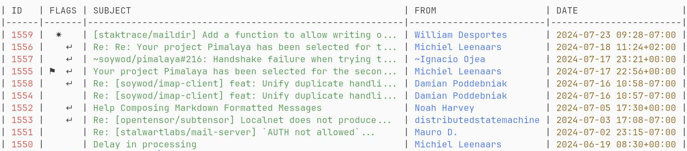

<div align="center">
  
  <h1>📫 Himalaya</h1>
  <p>CLI to manage emails</p>
  <p>
    <a href="https://matrix.to/#/#pimalaya:matrix.org"></a>
    <a href="https://fosstodon.org/@pimalaya"></a>
  </p>
</div>



> [!IMPORTANT]
> This README documents Himalaya v2, which is **not yet released**. If you are running v1 (`himalaya v1.2.0` or earlier), refer to the [v1.2.0 README](https://github.com/pimalaya/himalaya/blob/v1.2.0/README.md) instead. The [MIGRATION.md](./MIGRATION.md) guide walks v1 users through the breaking changes.

## Table of contents

- [Features](#features)
- [Installation](#installation)
  - [Pre-built binary](#pre-built-binary)
  - [Cargo](#cargo)
  - [Arch Linux](#arch-linux)
  - [Homebrew](#homebrew)
  - [Scoop](#scoop)
  - [Fedora Linux/CentOS/RHEL](#fedora-linuxcentosrhel)
  - [Nix](#nix)
  - [Sources](#sources)
- [Configuration](#configuration)
  - [Proton Mail](#proton-mail)
  - [Gmail](#gmail)
  - [Outlook](#outlook)
  - [iCloud Mail](#icloud-mail)
- [Usage](#usage)
  - [Shared API](#shared-api)
  - [Protocol-specific APIs](#protocol-specific-apis)
  - [Composing messages](#composing-messages)
  - [Reading messages](#reading-messages)
  - [Re-using sessions](#re-using-sessions)
- [Interfaces](#interfaces)
- [FAQ](#faq)
- [License](#license)
- [AI disclosure](#ai-disclosure)
- [Social](#social)
- [Sponsoring](#sponsoring)

## Features

- **Shared API** that maps `mailboxes`, `envelopes`, `flags`, `messages` and `attachments` to the active backend
- **Protocol-specific APIs** exposing each backend's full surface (`himalaya imap/smtp/jmap/gmail/msgraph/maildir…`)
- Remote backend support: **IMAP**, **SMTP**, **JMAP**, **Gmail** (REST API), **Microsoft Graph** (Outlook / Microsoft 365)
- Local (filesystem) backends support: **Maildir** <sup>[specs](https://cr.yp.to/proto/maildir.html)</sup>, **m2dir** <sup>[specs](https://man.sr.ht/~bitfehler/m2dir/)</sup>
- **Simple auth** support for IMAP/SMTP: anonymous, login, plain, oauthbearer, xoauth2, scram-sha-256
- **HTTP auth** support for JMAP: basic, bearer
- **TLS** support:
  - [Rustls](https://crates.io/crates/rustls) with ring crypto
  - [Rustls](https://crates.io/crates/rustls) with aws crypto (requires `rustls-aws` feature)
  - [Native TLS](https://crates.io/crates/native-tls) (requires `native-tls` feature)
- **Discovery** support:
  - PACC <sup>[specs](https://datatracker.ietf.org/doc/html/draft-ietf-mailmaint-pacc)</sup>
  - Autoconfiguration (Thunderbird) <sup>[specs](https://wiki.mozilla.org/Thunderbird:Autoconfiguration)</sup>
  - SRV DNS lookups <sup>[rfc6186](https://datatracker.ietf.org/doc/html/rfc6186)</sup>
- **TOML configuration** with multi-account support
- **Shared configuration file** with `himalaya-tui`: same `[accounts.<name>]` blocks load on both binaries (see [Configuration](#configuration))
- **JSON** output via `--json`

> [!TIP]
> Himalaya is written in [Rust](https://www.rust-lang.org/) and uses [cargo features](https://doc.rust-lang.org/cargo/reference/features.html) to gate backend support. The default feature set is declared in [Cargo.toml](./Cargo.toml).

## Installation

### Pre-built binary

Himalaya can be installed with the installer:

*As root:*

```
curl -sSL https://raw.githubusercontent.com/pimalaya/himalaya/master/install.sh | sudo sh
```

*As a regular user:*

```
curl -sSL https://raw.githubusercontent.com/pimalaya/himalaya/master/install.sh | PREFIX=~/.local sh
```

These commands install the latest binary from the GitHub [releases](https://github.com/pimalaya/himalaya/releases) section.

For a more up-to-date version than the latest release, check out the [releases](https://github.com/pimalaya/himalaya/actions/workflows/releases.yml) GitHub workflow and look for the *Artifacts* section. These pre-built binaries are built from the `master` branch.

> [!NOTE]
> Such binaries are built with the default cargo features. If you need specific features, please use another installation method.

### Cargo

```
cargo install --locked --git https://github.com/pimalaya/himalaya.git
```

With only IMAP+SMTP support:

```
cargo install --locked --git https://github.com/pimalaya/himalaya.git \
  --no-default-features \
  --features imap,smtp,rustls-ring
```

### Arch Linux

From the community repository:

```
pacman -S himalaya
```

Or the [user repository](https://aur.archlinux.org/):

```
git clone https://aur.archlinux.org/himalaya-git.git
cd himalaya-git
makepkg -isc
```

Or with [yay](https://github.com/Jguer/yay):

```
yay -S himalaya-git
```

### Homebrew

```
brew install himalaya
```

> [!NOTE]
> Cargo features are not compatible with brew. If you need a different feature set, please use another installation method.

### Scoop

```
scoop install himalaya
```

### Fedora Linux/CentOS/RHEL

From the [COPR](https://copr.fedorainfracloud.org/coprs/atim/himalaya/) repo:

```
dnf copr enable atim/himalaya
dnf install himalaya
```

### Nix

If you have the [Flakes](https://nixos.wiki/wiki/Flakes) feature enabled:

```
nix profile install github:pimalaya/himalaya
```

Or run without installing:

```
nix run github:pimalaya/himalaya
```

### Sources

```
git clone https://github.com/pimalaya/himalaya
cd himalaya
nix run
```

## Configuration

Run `himalaya`. With no configuration file on disk the wizard prompts for an account name and an email address, runs provider discovery (PACC, then Thunderbird Autoconfiguration, then RFC 6186 SRV), fills the IMAP/SMTP (or JMAP) prompts with the discovered defaults, then writes the result to disk.

A persistent configuration is loaded from the first valid path among:

- `$XDG_CONFIG_HOME/himalaya/config.toml`
- `$HOME/.config/himalaya/config.toml`
- `$HOME/.himalayarc`

These are the same paths the [himalaya-tui](https://github.com/pimalaya/himalaya-tui) TUI looks at: one TOML file backs both binaries. CLI-only fields and TUI-only sections coexist without errors. See [config.sample.toml](./config.sample.toml) for a documented template.

Override the path with `-c <PATH>`; multiple paths can be passed at once, separated by `:`. The first one is the base and the rest are deep-merged on top.

Accounts can be (re)configured later with `himalaya account configure <name>`. The wizard skips discovery in this mode: it reuses the existing values as prompt defaults.

### Proton Mail

Proton does not expose IMAP/SMTP directly: run [Proton Bridge](https://proton.me/mail/bridge), which synchronizes mail locally and serves it on a local IMAP/SMTP endpoint. The password is the one generated by the Bridge, not your Proton account password.

```toml
[accounts.proton]

imap.server = "imap://127.0.0.1:1143"
imap.sasl.plain.username = "example@proton.me"
imap.sasl.plain.password.command = "pass show proton-bridge"

smtp.server = "smtp://127.0.0.1:1025"
smtp.sasl.plain.username = "example@proton.me"
smtp.sasl.plain.password.command = "pass show proton-bridge"
```

To keep TLS on the local link, export the certificate generated by the Bridge and enable STARTTLS:

```toml
imap.starttls = true
imap.tls.cert = "/path/to/exported/cert.pem"

smtp.starttls = true
smtp.tls.cert = "/path/to/exported/cert.pem"
```

### Gmail

Gmail rejects the account password over SASL PLAIN: generate an [app password](https://myaccount.google.com/apppasswords) (requires 2-step verification) and feed it through `password.command` or `password.raw`.

```toml
[accounts.gmail]
default = true

imap.server = "imaps://imap.gmail.com:993"
imap.sasl.plain.username = "example@gmail.com"
imap.sasl.plain.password.command = "pass show gmail"

smtp.server = "smtps://smtp.gmail.com:465"
smtp.sasl.plain.username = "example@gmail.com"
smtp.sasl.plain.password.command = "pass show gmail"

mailbox.alias.inbox = "INBOX"
mailbox.alias.sent = "[Gmail]/Sent Mail"
mailbox.alias.drafts = "[Gmail]/Drafts"
mailbox.alias.trash = "[Gmail]/Trash"
mailbox.alias.archive = "[Gmail]/All Mail"
```

Every Gmail label shows up as a top-level IMAP mailbox, and the special mailboxes live under the `[Gmail]/` prefix — quote them in the shell (`-m "[Gmail]/Drafts"`) or reach them through an alias. `[Gmail]/All Mail` is the archive containing every message: aliasing it makes "search everything" one flag away (`himalaya envelope search -m archive ...`).

### Outlook

Microsoft has retired basic authentication: use OAuth 2.0 via `oauthbearer` or `xoauth2`, with the access token supplied by an external helper such as [ortie](https://github.com/pimalaya/ortie).

```toml
[accounts.outlook]

imap.server = "imaps://outlook.office365.com:993"
imap.sasl.xoauth2.username = "example@outlook.com"
imap.sasl.xoauth2.token.command = ["ortie", "token", "read", "outlook"]

smtp.server = "smtp://smtp-mail.outlook.com:587"
smtp.starttls = true
smtp.sasl.xoauth2.username = "example@outlook.com"
smtp.sasl.xoauth2.token.command = ["ortie", "token", "read", "outlook"]
```

### iCloud Mail

From the [iCloud Mail](https://support.apple.com/en-us/HT202304) support page: the IMAP login is the name of your address (`johnappleseed`, not `johnappleseed@icloud.com`) while the SMTP login is the full address, and a dedicated [app-specific password](https://support.apple.com/en-us/HT204397) is required.

```toml
[accounts.icloud]

imap.server = "imaps://imap.mail.me.com:993"
imap.sasl.plain.username = "johnappleseed"
imap.sasl.plain.password.command = "pass show icloud"

smtp.server = "smtp://smtp.mail.me.com:587"
smtp.starttls = true
smtp.sasl.plain.username = "johnappleseed@icloud.com"
smtp.sasl.plain.password.command = "pass show icloud"

mailbox.alias.sent = "Sent Messages"
```

## Usage

### Shared API

Backend-agnostic commands operate on the account's first configured backend, or the one selected with `-b/--backend`:

```
himalaya mailbox list
himalaya envelope list -m INBOX --page 2
himalaya envelope search from alice and after 2026-01-01 order by date desc
himalaya flag add -m INBOX --flag seen 1:3,5
himalaya message copy --from INBOX --to Archives 42
himalaya attachment download -m INBOX 42
```

When the `inbox` alias is configured under `[mailbox.alias]`, `-m/--mailbox` becomes optional: shared commands fall back to that id. With `[mailbox.alias] inbox = "INBOX"`, the calls above shorten to `envelope list --page 2`, `flag add --flag seen 1:3,5`, etc.

`envelope list` is plain pagination, ordered by date descending. To filter or sort, use `envelope search` with a trailing query covering `date`, `after`, `from`, `to`, `subject`, `body`, `flag` conditions (combined with `and`, `or`, `not`, grouped with parens) and an `order by date|from|to|subject [asc|desc]` sort chain. Date clauses target the `Date:` header (sent-at) on every backend. The full grammar lives in `himalaya envelope search --help`, which is the source of truth for the query DSL.

The query DSL is himalaya's own and compiles to each backend's native search: provider-specific operators (Gmail's `in:`/`label:` syntax, `X-GM-RAW`, …) are not supported. On IMAP the search currently runs server-side as `UID SORT`, so it requires the `SORT` capability — servers without it (notably Gmail) reject the command for now (see [#698](https://github.com/pimalaya/himalaya/issues/698)).

The shared surface is a strict least-common-denominator subset across IMAP, JMAP, Gmail, Microsoft Graph, Maildir and m2dir. Operations that do not generalize (mailbox roles, attribute flags, JMAP-specific queries…) live under the protocol-specific subcommands.

### Protocol-specific APIs

Each backend exposes its full native API under its own subgroup:

```sh
himalaya imap select INBOX
himalaya imap status INBOX
himalaya imap subscribe INBOX
himalaya imap raw 'SEARCH FROM "alice@example.com"'

himalaya jmap mailbox query --role drafts
himalaya jmap identity get
himalaya jmap vacation get

himalaya gmail messages list -q "from:alice is:unread"
himalaya gmail labels list

himalaya msgraph message list --folder inbox
himalaya msgraph mail-folder list

himalaya maildir create Archives
himalaya maildir messages save -m ~/Mail/example/Archives < message.eml

himalaya smtp send -f me@example.com -t you@example.com < message.eml
himalaya smtp raw 'VRFY postmaster'
```

The `-b/--backend` flag is only consumed by the shared commands; protocol subcommands always use their own backend.

### Composing messages

The built-in `message compose` / `reply` / `forward` commands cover simple cases via CLI flags:

```
himalaya message compose --from me@example.org --to you@example.org \
    --subject "Hello" --body "Hi!" --send
```

For richer composition (multipart MIME, MML directives, signing/encryption, editor-driven workflows), chain a standalone composer such as [mml](https://github.com/pimalaya/mml) into `message send` / `message add` through a tempfile or bash/zsh process substitution:

```sh
# Explicit tempfile, works in plain POSIX sh
mml compose /tmp/draft.eml && himalaya message send /tmp/draft.eml

# Bash / zsh process substitution, single command, no tempfile
mml compose >(himalaya message send)
himalaya message read 42 | mml reply >(himalaya message send)
```

The path-arg or process-substitution forms keep the composer's stdout connected to the terminal, so any `$EDITOR` it spawns sees a real tty. The bare-pipe form (`mml compose | himalaya message send`) hangs because the editor inherits a pipe on its stdout.

A prepared RFC 5322 file can also be staged as a draft instead of sent right away — handy for "compose, review in another client, then send" workflows:

```sh
himalaya message add -m drafts --flag draft < message.eml  # save as draft
himalaya message send --save sent < message.eml            # send + keep a copy
```

Both `-m`/`--save` values are resolved through the account's `[mailbox.alias]` map.

### Reading messages

`himalaya message read <ID>` renders headers and text bodies; `--raw` dumps the original RFC 5322 bytes; `--json` emits the parsed message. A few behaviours worth knowing, especially when scripting:

- Reading is side-effect-free: messages are fetched with `BODY.PEEK`, so `message read` never sets `\Seen`. Mark explicitly with `flag add --flag seen <ID>`.
- Ids are per-mailbox (IMAP UID, JMAP email id or Maildir filename id): the same message gets a new id when copied or moved. The `message-id` field exposed in `--json` envelope output is the stable cross-mailbox key.
- Every command accepts `--json`; envelope listings serialize as `{"envelopes": [{"id", "message-id", "flags": [{"raw", "iana"}], "subject", "from": [{"name", "email"}], "to", "date", "size", "has-attachment"}]}`.

### Re-using sessions

Each invocation opens a fresh TCP+TLS+SASL session by default. To amortize the handshake across many commands, pair himalaya with [`sirup`](https://github.com/pimalaya/sirup): `sirup` exposes a pre-authenticated IMAP/SMTP session over a Unix socket, and himalaya can point its `imap.server` / `smtp.server` at that socket.

## Interfaces

Himalaya CLI is one of several front-ends to the Pimalaya libraries:

- [pimalaya/himalaya-tui](https://github.com/pimalaya/himalaya-tui): official TUI (in active development)
- [pimalaya/himalaya-vim](https://github.com/pimalaya/himalaya-vim): Vim plugin
- [dantecatalfamo/himalaya-emacs](https://github.com/dantecatalfamo/himalaya-emacs): Emacs plugin
- [jns/himalaya](https://www.raycast.com/jns/himalaya): Raycast extension
- [openclaw/openclaw](https://github.com/openclaw/openclaw/blob/main/skills/himalaya/SKILL.md): OpenClaw SKILL
- [parisni/dfzf](https://github.com/parisni/dfzf): dfzf integration

## FAQ

<details>
  <summary>How different is it from aerc, mutt or alpine?</summary>

  Aerc, mutt and alpine can be categorized as Terminal User Interfaces (TUI). When the program is executed, your terminal is locked into an event loop and you interact with your emails using keybinds.

  Himalaya is a Command-Line Interface (CLI). There is no event loop: you interact with your emails using shell commands, in a stateless way.

  A dedicated TUI ([himalaya-tui](https://github.com/pimalaya/himalaya-tui)) is in active development on top of the same Pimalaya libraries, and is definitely closer to aerc, mutt and alpine.
</details>

<details>
  <summary>How are secrets resolved?</summary>

  Every `*.passwd` / `*.password` / `*.token` field accepts either a raw literal or a shell command that prints the secret on stdout. The raw form is convenient for testing but should not be used in production:

  ```toml
  imap.sasl.plain.passwd.raw = "***"
  imap.sasl.plain.passwd.command = "pass show example"
  imap.sasl.plain.passwd.command = ["pass", "show", "example"]
  ```

  Native keyring support was removed in v2. Use a third-party keyring CLI (`pass`, `secret-tool`, `gopass`…) as the `command`.
</details>

<details>
  <summary>How is OAuth 2.0 handled?</summary>

  v2 does not ship OAuth flows. Use [pimalaya/ortie](https://github.com/pimalaya/ortie) (or any other token broker) to obtain an access token, then plug it as a `command` returning the token on stdout. For JMAP, point `jmap.auth.bearer.token.command` at the broker; for IMAP/SMTP, route the bearer through a SASL mechanism that consumes a command-sourced password.
</details>

<details>
  <summary>How does the wizard discover IMAP/SMTP/JMAP configs?</summary>

  The wizard runs three discovery mechanisms in series on the email address domain; the first non-empty hit wins:

  1. **PACC** <sup>[draft-ietf-mailmaint-pacc-02](https://datatracker.ietf.org/doc/html/draft-ietf-mailmaint-pacc-02)</sup>: well-known JSON, digest-verified against the `_ua-auto-config` TXT record.
  2. **Thunderbird Autoconfiguration**: ISP main / well-known / ISPDB lookups, then MX-based retry, then the `mailconf=<URL>` TXT redirect.
  3. **RFC 6186 SRV**: `_imap._tcp`, `_imaps._tcp`, `_submission._tcp` lookups assembled into a single report.

  See [pimconf](https://github.com/pimalaya/pimconf) for the full chain.
</details>

<details>
  <summary>How to debug Himalaya?</summary>

  Use `--log-level <level>` (alias `--log`) where `<level>` is one of `off`, `error`, `warn`, `info`, `debug`, `trace`:

  ```
  himalaya --log trace mailbox list
  ```

  The `RUST_LOG` environment variable is consulted when `--log` is not passed, and supports per-target filters (see the [`env_logger` documentation](https://docs.rs/env_logger/latest/env_logger/#enabling-logging)). `RUST_BACKTRACE=1` enables full error backtraces.

  Logs are written to `stderr`, so they can be redirected easily to a file:

  ```
  himalaya --log trace mailbox list 2>/tmp/himalaya.log
  ```

  You can also send logs straight to a file via `--log-file <path>`:

  ```
  himalaya --log trace --log-file /tmp/himalaya.log mailbox list
  ```
</details>

<details>
  <summary>How to disable color output?</summary>

  Set `NO_COLOR=1` in your environment.
</details>

## License

This project is licensed under either of:

- [MIT license](LICENSE-MIT)
- [Apache License, Version 2.0](LICENSE-APACHE)

at your option.

## AI disclosure

This project is developed with AI assistance. This section documents how, so users and downstream packagers can make informed decisions.

- **Tools**: Claude Code (Anthropic), Opus 4.7, invoked locally with a persistent project-scoped memory and a small set of repo-specific rules.

- **Used for**: Refactors, mechanical multi-file edits, boilerplate (feature gates, error enums, derive macros, trait impls), test scaffolding, doc polish, exploratory design conversations.

- **Not used for**: Engineering, critical code, git manipulation (commit, merge, rebase…), real-world tests.

- **Verification**: Every AI-assisted change is read, compiled, tested, and formatted before commit (`nix develop --command cargo check / cargo test / cargo fmt`). Behavioural correctness is verified against the relevant RFC or upstream spec, not assumed from the model output. Tests are never adjusted to fit AI-generated code; the code is adjusted to fit correct behaviour.

- **Limitations**: AI models occasionally produce code that compiles and passes tests but is subtly wrong: off-by-one errors, missed edge cases, plausible but nonexistent APIs, stale RFC references. The verification workflow catches most of this; it does not catch all of it. Bug reports are welcome and taken seriously.

- **Last reviewed**: 31/05/2026

## Social

- Chat on [Matrix](https://matrix.to/#/#pimalaya:matrix.org)
- News on [Mastodon](https://fosstodon.org/@pimalaya) or [RSS](https://fosstodon.org/@pimalaya.rss)
- Mail at [pimalaya.org@posteo.net](mailto:pimalaya.org@posteo.net)

## Sponsoring

[](https://nlnet.nl/)

Special thanks to the [NLnet foundation](https://nlnet.nl/) and the [European Commission](https://www.ngi.eu/) that have been financially supporting the project for years:

- 2022 → 2023: [NGI Assure](https://nlnet.nl/project/Himalaya/)
- 2023 → 2024: [NGI Zero Entrust](https://nlnet.nl/project/Pimalaya/)
- 2024 → 2026: [NGI Zero Core](https://nlnet.nl/project/Pimalaya-PIM/)
- *2027 in preparation…*

If you appreciate the project, feel free to donate using one of the following providers:

[](https://github.com/sponsors/soywod)
[](https://ko-fi.com/soywod)
[](https://www.buymeacoffee.com/soywod)
[](https://liberapay.com/soywod)
[![thanks.dev](https://img.shields.io/badge/-thanks.dev-000000?logo=)](https://thanks.dev/soywod)
[](https://www.paypal.com/paypalme/soywod)
