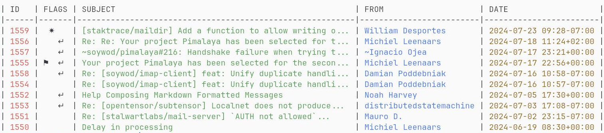

<div align="center">
  
  <h1>📫 Himalaya</h1>
  <p>CLI to manage emails</p>
  <p>
    <a href="https://matrix.to/#/#pimalaya:matrix.org"></a>
    <a href="https://fosstodon.org/@pimalaya"></a>
    <a href="https://pimalaya.org/sponsor/"></a>
  </p>
</div>



## Table of contents

- [Features](#features)
- [Installation](#installation)
- [Configuration](#configuration)
- [Usage](#usage)
- [Interfaces](#interfaces)
- [FAQ](#faq)
- [AI policy](https://github.com/pimalaya/.github/blob/master/AI_POLICY.md)
- [License](#license)
- [Social](#social)
- [Contributing](./CONTRIBUTING.md)
- [Sponsoring](#sponsoring)

## Features

- **Shared API** for `mailboxes`, `envelopes`, `flags`, `messages` and `attachments`
- **Protocol-specific APIs** exposing each backend's full surface
- **IMAP**, **SMTP**, **ManageSieve**, **JMAP**, **Gmail** (REST API), **Microsoft Graph** (Outlook / Microsoft 365) support
- **Maildir** <sup>[specs](https://cr.yp.to/proto/maildir.html)</sup>, **m2dir** <sup>[specs](https://man.sr.ht/~bitfehler/m2dir/)</sup>, **pimdir** <sup>[specs](https://github.com/pimalaya/pimdir)</sup> support
- **Simple auth** support for IMAP, SMTP and ManageSieve (anonymous, login, plain, oauthbearer, xoauth2, scram-sha-256)
- **HTTP auth** support for JMAP: basic, bearer
- **TLS** support:
  - [Rustls](https://crates.io/crates/rustls) with ring crypto
  - [Rustls](https://crates.io/crates/rustls) with aws crypto (requires `rustls-aws` feature)
  - [Native TLS](https://crates.io/crates/native-tls) (requires `native-tls` feature)
- **Discovery** support:
  - PACC <sup>[specs](https://datatracker.ietf.org/doc/html/draft-ietf-mailmaint-pacc)</sup>
  - Autoconfiguration (Thunderbird) <sup>[specs](https://wiki.mozilla.org/Thunderbird:Autoconfiguration)</sup>
  - SRV DNS lookups <sup>[rfc6186](https://datatracker.ietf.org/doc/html/rfc6186)</sup>
  - JMAP session resolution <sup>[rfc8620](https://datatracker.ietf.org/doc/html/rfc8620)</sup>
- **SOCKS5**, **HTTP** proxy support via `$ALL_PROXY` and `$HTTP_PROXY`
- **TOML configuration** with multi-account support
- **JSON** output via `--json`

> [!TIP]
> Himalaya is written in [Rust](https://www.rust-lang.org/) and uses [cargo features](https://doc.rust-lang.org/cargo/reference/features.html) to gate backend support. The default feature set is declared in [Cargo.toml](./Cargo.toml).

## Installation

### Pre-built binary

Himalaya can be installed with the installer:

*As root:*

```
curl -sSL https://raw.githubusercontent.com/pimalaya/himalaya/master/install.sh | sudo sh
```

*As a regular user:*

```
curl -sSL https://raw.githubusercontent.com/pimalaya/himalaya/master/install.sh | PREFIX=~/.local sh
```

These commands install the latest binary from the GitHub [releases](https://github.com/pimalaya/himalaya/releases) section.

For a more up-to-date version than the latest release, check out the [releases](https://github.com/pimalaya/himalaya/actions/workflows/releases.yml) GitHub workflow and look for the *Artifacts* section. These pre-built binaries are built from the `master` branch.

> [!NOTE]
> Such binaries are built with the default cargo features. If you need specific features, please use another installation method.

### Cargo

```
cargo install --locked --git https://github.com/pimalaya/himalaya.git
```

With only IMAP+SMTP support:

```
cargo install --locked --git https://github.com/pimalaya/himalaya.git \
  --no-default-features \
  --features imap,smtp,rustls-ring
```

### Arch Linux

From the community repository:

```
pacman -S himalaya
```

Or the [user repository](https://aur.archlinux.org/):

```
git clone https://aur.archlinux.org/himalaya-git.git
cd himalaya-git
makepkg -isc
```

Or with [yay](https://github.com/Jguer/yay):

```
yay -S himalaya-git
```

### Homebrew

```
brew install himalaya
```

> [!NOTE]
> Cargo features are not compatible with brew. If you need a different feature set, please use another installation method.

### Scoop

```
scoop install himalaya
```

### Fedora Linux/CentOS/RHEL

From the [COPR](https://copr.fedorainfracloud.org/coprs/atim/himalaya/) repo:

```
dnf copr enable atim/himalaya
dnf install himalaya
```

### Nix

If you have the [Flakes](https://nixos.wiki/wiki/Flakes) feature enabled:

```
nix profile install github:pimalaya/himalaya
```

Or run without installing:

```
nix run github:pimalaya/himalaya
```

### Sources

```
git clone https://github.com/pimalaya/himalaya
cd himalaya
nix run
```

## Configuration

Run `himalaya`. With no configuration file on disk the wizard prompts for an account name and an email address, runs provider discovery (PACC, Thunderbird Autoconfiguration, RFC 6186 SRV and RFC 8620 JMAP resolution, all probed in parallel and merged), fills the IMAP/SMTP (or JMAP) prompts with the discovered defaults, then writes the result to disk.

A persistent configuration is loaded from the first valid path among:

- `$XDG_CONFIG_HOME/himalaya/config.toml`
- `$HOME/.config/himalaya/config.toml`
- `$HOME/.himalayarc`

These are the same paths the [himalaya-tui](https://github.com/pimalaya/himalaya-tui) TUI looks at: one TOML file backs both binaries. CLI-only fields and TUI-only sections coexist without errors. See [config.sample.toml](./config.sample.toml) for a documented template.

Override the path with `-c <PATH>`; multiple paths can be passed at once, separated by `:`. The first one is the base and the rest are deep-merged on top.

To add or reconfigure an account, run the bare `himalaya` wizard again and redirect its printed TOML into (or merge it with) your config file. There is no in-place edit subcommand; `himalaya account list` and `himalaya account check` inspect and validate the accounts already declared.

### Proton Mail

Proton does not expose IMAP/SMTP directly: run [Proton Bridge](https://proton.me/mail/bridge), which synchronizes mail locally and serves it on a local IMAP/SMTP endpoint. The password is the one generated by the Bridge, not your Proton account password.

```toml
[accounts.proton]

imap.server = "imap://127.0.0.1:1143"
imap.sasl.plain.username = "example@proton.me"
imap.sasl.plain.password.command = "pass show proton-bridge"

smtp.server = "smtp://127.0.0.1:1025"
smtp.sasl.plain.username = "example@proton.me"
smtp.sasl.plain.password.command = "pass show proton-bridge"
```

To keep TLS on the local link, export the certificate generated by the Bridge and enable STARTTLS:

```toml
imap.starttls = true
imap.tls.cert = "/path/to/exported/cert.pem"

smtp.starttls = true
smtp.tls.cert = "/path/to/exported/cert.pem"
```

### Fastmail

Fastmail needs an [app password](https://www.fastmail.help/hc/en-us/articles/360058752854) for IMAP/SMTP, or an [API token](https://www.fastmail.help/hc/en-us/articles/5254602856719) for its native JMAP endpoint.

```toml
[accounts.fastmail]

imap.server = "imaps://imap.fastmail.com"
imap.sasl.plain.username = "example@fastmail.com"
imap.sasl.plain.password.command = "pass show fastmail"

smtp.server = "smtps://smtp.fastmail.com"
smtp.sasl.plain.username = "example@fastmail.com"
smtp.sasl.plain.password.command = "pass show fastmail"
```

To use JMAP instead, replace the `imap`/`smtp` blocks with a single `jmap` one:

```toml
jmap.server = "https://api.fastmail.com/jmap/session"
jmap.auth.bearer.token.command = "pass show fastmail"
```

### Gmail

Gmail rejects the account password over SASL PLAIN: generate an [app password](https://myaccount.google.com/apppasswords) (requires 2-step verification) and feed it through `password.command` or `password.raw`.

```toml
[accounts.gmail]

imap.server = "imaps://imap.gmail.com:993"
imap.sasl.plain.username = "example@gmail.com"
imap.sasl.plain.password.command = "pass show gmail"

smtp.server = "smtps://smtp.gmail.com:465"
smtp.sasl.plain.username = "example@gmail.com"
smtp.sasl.plain.password.command = "pass show gmail"

mailbox.alias.inbox = "INBOX"
mailbox.alias.sent = "[Gmail]/Sent Mail"
mailbox.alias.drafts = "[Gmail]/Drafts"
mailbox.alias.trash = "[Gmail]/Trash"
mailbox.alias.archive = "[Gmail]/All Mail"
```

Every Gmail label shows up as a top-level IMAP mailbox, and the special mailboxes live under the `[Gmail]/` prefix — quote them in the shell (`-m "[Gmail]/Drafts"`) or reach them through an alias. `[Gmail]/All Mail` is the archive containing every message: aliasing it makes "search everything" one flag away (`himalaya envelope search -m archive ...`).

To use Gmail's native REST API instead of IMAP/SMTP, replace the blocks above with a single OAuth 2.0 bearer token from a helper such as [ortie](https://github.com/pimalaya/ortie):

```toml
gmail.auth.token.command = ["ortie", "token", "show", "-a", "gmail"]
```

Labels become mailboxes here too, but they carry the API's opaque label ids; address them by name (`-m Himalaya-Test`) and himalaya resolves the id.

### Outlook

Microsoft has retired basic authentication: use OAuth 2.0 via `oauthbearer` or `xoauth2`, with the access token supplied by an external helper such as [ortie](https://github.com/pimalaya/ortie).

```toml
[accounts.outlook]

imap.server = "imaps://outlook.office365.com:993"
imap.sasl.xoauth2.username = "example@outlook.com"
imap.sasl.xoauth2.token.command = ["ortie", "token", "show", "-a", "outlook"]

smtp.server = "smtp://smtp-mail.outlook.com:587"
smtp.starttls = true
smtp.sasl.xoauth2.username = "example@outlook.com"
smtp.sasl.xoauth2.token.command = ["ortie", "token", "show", "-a", "outlook"]
```

To use the native Microsoft Graph API instead of IMAP/SMTP, replace the blocks above with a single OAuth 2.0 bearer token (sending goes through Graph too, so no SMTP is needed):

```toml
msgraph.auth.token.command = ["ortie", "token", "show", "-a", "msgraph"]
```

Mail folders carry Graph's opaque folder ids; address them by name (`-m Archive`) or by a well-known name (`-m inbox`) and himalaya resolves the id.

### Posteo

Standard IMAP/SMTP with your regular account password — no app password required.

```toml
[accounts.posteo]

imap.server = "imaps://posteo.de"
imap.sasl.plain.username = "example@posteo.net"
imap.sasl.plain.password.command = "pass show posteo"

smtp.server = "smtps://posteo.de"
smtp.sasl.plain.username = "example@posteo.net"
smtp.sasl.plain.password.command = "pass show posteo"
```

### iCloud Mail

From the [iCloud Mail](https://support.apple.com/en-us/HT202304) support page: the IMAP login is the name of your address (`johnappleseed`, not `johnappleseed@icloud.com`) while the SMTP login is the full address, and a dedicated [app-specific password](https://support.apple.com/en-us/HT204397) is required.

```toml
[accounts.icloud]

imap.server = "imaps://imap.mail.me.com:993"
imap.sasl.plain.username = "johnappleseed"
imap.sasl.plain.password.command = "pass show icloud"

smtp.server = "smtp://smtp.mail.me.com:587"
smtp.starttls = true
smtp.sasl.plain.username = "johnappleseed@icloud.com"
smtp.sasl.plain.password.command = "pass show icloud"

mailbox.alias.sent = "Sent Messages"
```

## Usage

Every command carries its own `--help`, the source of truth for its flags and syntax. The snippets below are a taste of the surface.

### Shared API

Backend-agnostic commands run on the account's first configured backend, or the one picked with `-b/--backend`. When an `inbox` alias is set under `[mailbox.alias]`, `-m/--mailbox` defaults to it.

```sh
himalaya mailbox list
himalaya envelope list --page 2
himalaya envelope search from alice and after 2026-01-01 order by date desc
himalaya flag add --flag seen 1:3,5
himalaya message read 42
himalaya message copy --from INBOX --to Archives 42
himalaya attachment download 42
```

`envelope search` uses himalaya's own cross-backend query DSL; its grammar lives in `himalaya envelope search --help`.

### Protocol-specific APIs

Each backend also exposes its full native API under its own subgroup, always against that backend (`-b/--backend` is ignored here):

```sh
himalaya imap raw 'a1 SEARCH FROM "alice@example.com"\r\n'
himalaya jmap mailbox query --role drafts
himalaya gmail messages list -q "from:alice is:unread"
himalaya msgraph mail-folder list
himalaya smtp send -f me@example.com -t you@example.com < message.eml
himalaya sieve list
himalaya sieve check --script-file filters.sieve
himalaya sieve put main --script-file filters.sieve
himalaya sieve activate main
```

ManageSieve uses the optional `sieve` account block. RFC 5804 registers one port, 4190, and reaches TLS through STARTTLS rather than through a second port, so a bare server address resolves to `sieve://` with the upgrade on, where the IMAP and SMTP ones resolve to their implicit-TLS scheme. `sieves://` is accepted too, for the deployments listening for a TLS handshake straight away. A password or a bearer token is refused on an unencrypted connection unless `sieve.allow-cleartext-auth` says otherwise. `sieve capability`, `list`, `get`, `put`, `check`, `activate`, `deactivate`, `rename`, `delete` and `raw` are available, and `put` and `check` accept a script file, inline text, or stdin.

### Composing messages

`message compose` / `reply` / `forward` cover simple cases through flags. For rich MIME (MML directives, signing, encryption, an editor-driven flow), chain a composer such as [mml](https://github.com/pimalaya/mml) into `message send` / `message add`, or stage a prepared file as a draft:

```sh
himalaya message compose --to you@example.org --subject Hello --body Hi --send
mml compose >(himalaya message send)
himalaya message add -m drafts --flag draft < message.eml
```

See `himalaya message send --help` and the [mml](https://github.com/pimalaya/mml) docs for the composer chaining.

### Re-using sessions

Each invocation opens a fresh TCP+TLS+SASL session. To amortize the handshake, pair himalaya with [sirup](https://github.com/pimalaya/sirup): it serves a pre-authenticated IMAP/SMTP session over a Unix socket that `imap.server` / `smtp.server` can point at.

## Interfaces

Himalaya CLI is one of several front-ends to the Pimalaya libraries:

- [pimalaya/himalaya-tui](https://github.com/pimalaya/himalaya-tui): official TUI (in active development)
- [pimalaya/himalaya-vim](https://github.com/pimalaya/himalaya-vim): Vim plugin
- [dantecatalfamo/himalaya-emacs](https://github.com/dantecatalfamo/himalaya-emacs): Emacs plugin
- [jns/himalaya](https://www.raycast.com/jns/himalaya): Raycast extension
- [openclaw/openclaw](https://github.com/openclaw/openclaw/blob/main/skills/himalaya/SKILL.md): OpenClaw SKILL
- [parisni/dfzf](https://github.com/parisni/dfzf): dfzf integration

## FAQ

<details>
  <summary>How different is it from aerc, mutt or alpine?</summary>

  Aerc, mutt and alpine can be categorized as Terminal User Interfaces (TUI). When the program is executed, your terminal is locked into an event loop and you interact with your emails using keybinds.

  Himalaya is a Command-Line Interface (CLI). There is no event loop: you interact with your emails using shell commands, in a stateless way.

  A dedicated TUI ([himalaya-tui](https://github.com/pimalaya/himalaya-tui)) is in active development on top of the same Pimalaya libraries, and is definitely closer to aerc, mutt and alpine.
</details>

<details>
  <summary>How are secrets resolved?</summary>

  Every `*.passwd` / `*.password` / `*.token` field accepts either a raw literal or a shell command that prints the secret on stdout. The raw form is convenient for testing but should not be used in production:

  ```toml
  imap.sasl.plain.passwd.raw = "***"
  imap.sasl.plain.passwd.command = "pass show example"
  imap.sasl.plain.passwd.command = ["pass", "show", "example"]
  ```

  Native keyring support was removed in v2. Use a third-party keyring CLI (`pass`, `secret-tool`, `gopass`…) as the `command`.
</details>

<details>
  <summary>How is OAuth 2.0 handled?</summary>

  v2 does not ship OAuth flows. Use [pimalaya/ortie](https://github.com/pimalaya/ortie) (or any other token broker) to obtain an access token, then plug it as a `command` returning the token on stdout. For JMAP, point `jmap.auth.bearer.token.command` at the broker; for IMAP/SMTP, route the bearer through a SASL mechanism that consumes a command-sourced password.
</details>

<details>
  <summary>How does the wizard discover IMAP/SMTP/JMAP configs?</summary>

  The wizard probes several discovery mechanisms in parallel on the email address domain, merges their results and keeps the most secure endpoint per service:

  - **PACC** <sup>[draft-ietf-mailmaint-pacc-02](https://datatracker.ietf.org/doc/html/draft-ietf-mailmaint-pacc-02)</sup>: well-known JSON, digest-verified against the `_ua-auto-config` TXT record.
  - **Thunderbird Autoconfiguration**: ISP main / well-known / ISPDB lookups, then MX-based retry, then the `mailconf=<URL>` TXT redirect.
  - **RFC 6186 SRV**: `_imap._tcp`, `_imaps._tcp`, `_submission._tcp` lookups assembled into a single report.
  - **RFC 8620 JMAP**: the SRV record and the `/.well-known/jmap` session resource.

  A final WWW-Authenticate probe refines the advertised auth schemes, and a detected Google or Microsoft account short-circuits to its dedicated configurations. See [io-pim-discovery](https://github.com/pimalaya/io-pim-discovery) for the full chain.
</details>

<details>
  <summary>How to debug Himalaya?</summary>

  Use `--log-level <level>` (alias `--log`) where `<level>` is one of `off`, `error`, `warn`, `info`, `debug`, `trace`:

  ```
  himalaya --log trace mailbox list
  ```

  The `RUST_LOG` environment variable is consulted when `--log` is not passed, and supports per-target filters (see the [`env_logger` documentation](https://docs.rs/env_logger/latest/env_logger/#enabling-logging)). `RUST_BACKTRACE=1` enables full error backtraces.

  Logs are written to `stderr`, so they can be redirected easily to a file:

  ```
  himalaya --log trace mailbox list 2>/tmp/himalaya.log
  ```

  You can also send logs straight to a file via `--log-file <path>`:

  ```
  himalaya --log trace --log-file /tmp/himalaya.log mailbox list
  ```
</details>

<details>
  <summary>How to disable color output?</summary>

  Set `NO_COLOR=1` in your environment.
</details>

## License

This project is licensed under either of:

- [MIT license](LICENSE-MIT)
- [Apache License, Version 2.0](LICENSE-APACHE)

## Social

- Chat on [Matrix](https://matrix.to/#/#pimalaya:matrix.org)
- News on [Mastodon](https://fosstodon.org/@pimalaya) or [RSS](https://fosstodon.org/@pimalaya.rss)
- Mail at [pimalaya.org@posteo.net](mailto:pimalaya.org@posteo.net)

## Sponsoring

[](https://nlnet.nl/)

Special thanks to the [NLnet foundation](https://nlnet.nl/) and the [European Commission](https://www.ngi.eu/) that have been financially supporting the project for years:

- 2022 → 2023: [NGI Assure](https://nlnet.nl/project/Himalaya/)
- 2023 → 2024: [NGI Zero Entrust](https://nlnet.nl/project/Pimalaya/)
- 2024 → 2026: [NGI Zero Core](https://nlnet.nl/project/Pimalaya-PIM/)
- 2026 → 2027: [NGI Zero Commons Fund](https://nlnet.nl/project/Pimalaya-pimdir/)

This program is part of Pimalaya, free software funded entirely by grants and donations. If you find it useful, consider [sponsoring](https://pimalaya.org/sponsor/) its development:

[](https://github.com/sponsors/soywod)
[](https://ko-fi.com/pimalaya)
[](https://www.buymeacoffee.com/pimalaya)
[](https://liberapay.com/pimalaya)
[![thanks.dev](https://img.shields.io/badge/-thanks.dev-000000?logo=)](https://thanks.dev/u/gh/soywod)
[](https://www.paypal.com/paypalme/soywod)
